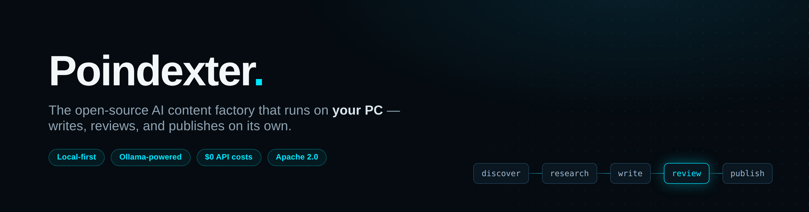
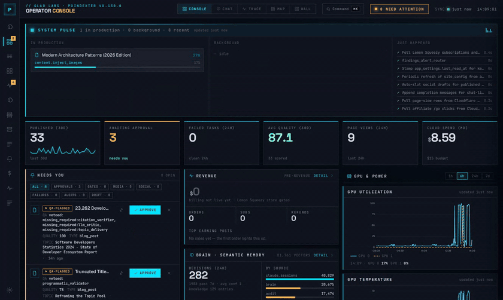
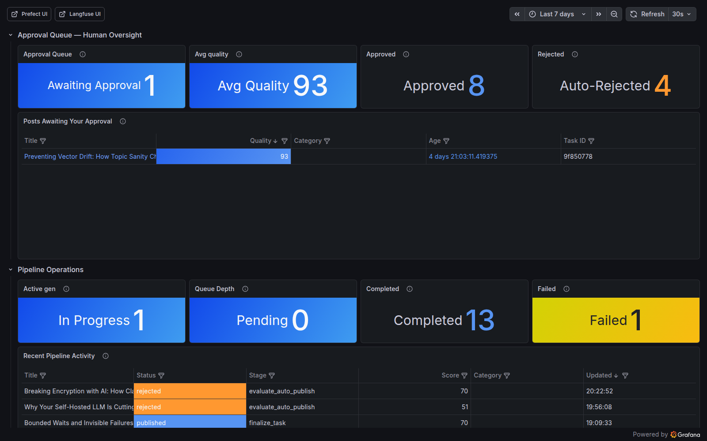
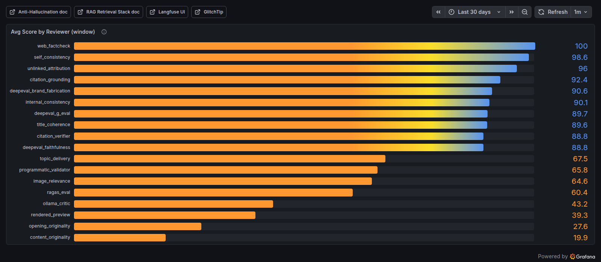
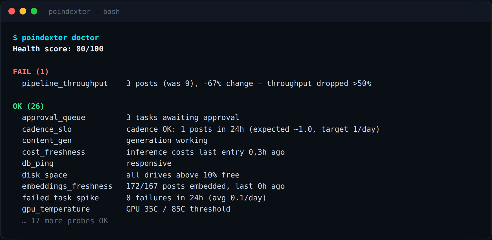
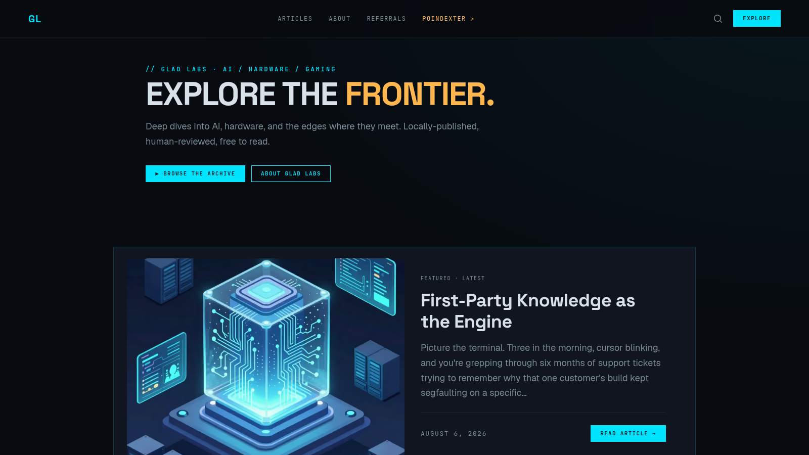
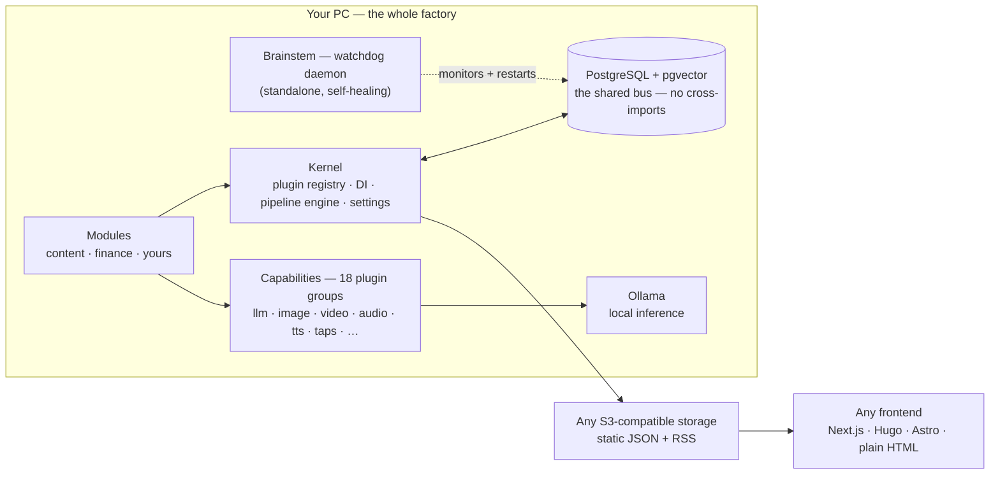

<div align="center">



**One engine that discovers topics, researches them, writes long-form posts, tears them apart in review, and publishes the survivors — on your GPU, with zero API costs.**

[](LICENSE)
[](https://github.com/Glad-Labs/poindexter/actions/workflows/unit-tests.yml)
[](https://github.com/Glad-Labs/poindexter/releases)
[](https://github.com/Glad-Labs/poindexter/actions/workflows/unit-tests.yml)
[](#project-status)
[](https://www.gladlabs.io)

[Quick start](#quick-start) · [What it does](#what-it-does) · [The QA gauntlet](#built-to-reject-its-own-work) · [Architecture](#architecture) · [Docs](https://gladlabs.mintlify.app/docs/welcome) · [Pro](#poindexter-pro)

</div>

---

This is not a demo repo. Poindexter is the production system behind [gladlabs.io](https://www.gladlabs.io) — 166 live posts and counting, every one generated, reviewed, and published by this pipeline on a single PC. Here is the operator's actual view of it running:



_The operator console (ships with the repo, served by the worker at `/console/`), recorded live: a post mid-generation, the approval inbox with per-task QA verdicts, pipeline traces, and the system map._



_The Pipeline dashboard (ships with the repo): drafts arrive scored, weak ones are auto-rejected, survivors wait for your one-click approval._

## Quick start

From clean machine to a running pipeline in about 30 minutes — most of it one-time model downloads.

**Prereqs:** [Docker](https://docker.com) · [Ollama](https://ollama.com) · Python 3.13+ · NVIDIA GPU with 8 GB+ VRAM (CPU works, just slowly) · Node.js 22+ only if you want the optional Next.js frontend. **Windows:** run from Git Bash or WSL2.

```bash
# 1. Clone
git clone https://github.com/Glad-Labs/poindexter.git && cd poindexter

# 2. Bootstrap — generates secrets, spins up Postgres, runs migrations, mints your OAuth client
pip install -e src/cofounder_agent
poindexter setup --auto

# 3. Pull the core models (one-time, ~30 GB total)
ollama pull gemma3:27b && ollama pull phi4:14b && ollama pull qwen3:8b && ollama pull nomic-embed-text

# 4. Start everything
bash scripts/start-stack.sh up -d

# 5. Queue your first post
poindexter tasks create "Why Docker changed everything"
```

Then watch it work:

- **Grafana** — [localhost:3000](http://localhost:3000), the Pipeline dashboard fills in as stages complete
- **Prefect** — [localhost:4200](http://localhost:4200), the orchestrator's view of the run
- **Terminal** — `poindexter doctor` for a full health report, `poindexter tasks list` for the queue

A few minutes later the draft lands in your approval queue with its QA scores attached (`poindexter tasks list --status awaiting_approval`). You approve; it publishes. That's the loop.

<details>
<summary><b>Which model does what — and what to upgrade first</b></summary>

<br>

| Model              | Size   | Role                                                  |
| ------------------ | ------ | ----------------------------------------------------- |
| `gemma3:27b`       | 16 GB  | Writer, fallback, structured + media-script tasks     |
| `phi4:14b`         | 9 GB   | Adversarial QA critic — the hard quality gate         |
| `qwen3:8b`         | 5 GB   | Fast tasks — SEO, image decisions, summaries, routing |
| `nomic-embed-text` | 274 MB | Embeddings for semantic search + memory retrieval     |

These four run the core blog pipeline (research → write → QA → publish) on any 8 GB+ GPU. The critic is a different model family from the writer **on purpose** — cross-model QA means their biases don't cancel. Feature roles pull additional public models on demand: image QA + captioning use `qwen3-vl:30b` (~20 GB — needs headroom past the 8 GB minimum), and the optional voice agent loads its own STT/TTS models. The core pipeline runs without them.

**The writer is the one model worth upgrading.** Set `pipeline_writer_model` to any Ollama model you have:

```bash
ollama pull qwen3:30b          # 18 GB — best speed/quality balance publicly available
ollama pull qwen3.5:35b        # 23 GB — stronger prose, slower
ollama pull llama3.3:70b       # 42 GB — highest quality, needs 48 GB+ VRAM or CPU offload
ollama pull glm-4.7:9b         # 6 GB — lighter fallback for <16 GB VRAM
```

Every model routing decision (writer / critic / research / summarizer / embedder) lives in `app_settings` and can be swapped at runtime — no restart, no redeploy. Cloud models (Anthropic, OpenAI, Groq, OpenRouter) are an opt-in plugin gated by a spend guard.

</details>

## What it does

One engine, eight jobs:

1. **Discovers** trending topics from HackerNews, Dev.to, and your niche feeds
2. **Researches** each topic with deep web search and source verification
3. **Writes** long-form posts using local LLMs — or cloud models via the optional LiteLLM plugin
4. **Reviews** every draft with multi-model adversarial QA (more on that below)
5. **Validates** against hallucinations — catches fake people, stats, quotes, impossible claims
6. **Publishes** to any frontend via static JSON export (push-only headless CMS)
7. **Generates** podcast episodes, AI images, and short text-to-video clips (alpha, opt-in)
8. **Monitors** itself with Grafana dashboards, self-heals via a watchdog daemon, alerts on Telegram/Discord

Run it on your machine. Own your data. No cloud lock-in.

## Built to reject its own work

Most AI content tools optimize for output volume. Poindexter optimizes for **curation**: it generates candidates, then makes each one survive 13 QA rails — cross-model LLM critics, DeepEval and Ragas evaluations, deterministic anti-hallucination validators, citation verification against the research corpus, and vision QA on every generated image. Roughly half of all drafts don't make it.



_Real 30-day per-reviewer averages from the QA Rails dashboard. The strict rails at the bottom are why the output doesn't read like AI slop — speed comes from generating more candidates and filtering hard, not from lowering the bar._

Every rail is DB-configurable: advisory or blocking per rail, thresholds tunable at runtime, and a bounded rescue cycle gives near-miss drafts one revision pass before the hard reject.

## It monitors itself, too

The stack treats itself like production infrastructure. A standalone watchdog daemon (the "brainstem") checks every service on a 5-minute cycle, restarts what it can, and pages you on Telegram/Discord for what it can't. The `doctor` command aggregates every health probe into one score:



_Real output. Note the FAIL: the system caught its own throughput drop and said so — you find out from the tool, not from silence._

And the output side is a real website, not a JSON blob in a bucket somewhere:



_[gladlabs.io](https://www.gladlabs.io) — built on the static JSON export. Bring any frontend: Next.js, Hugo, Astro, or a single HTML file._

## Who this is for

- **Solo operators** who want to run a content business from one machine, with their own GPU, without paying per-token API fees
- **Indie publishers** who need automation but refuse to ship hallucinated text
- **AI/ML engineers** who want a working content stack to fork, extend, and learn from — every layer is OSS, every layer is swappable

It is _not_ for marketing teams who want a one-click web app (use Jasper / Copy.ai), or anyone unwilling to run Docker.

## Architecture

Poindexter is a **kernel + modules + capabilities** stack. The kernel is the substrate everything rents — plugin registry, DI container, pipeline engine, settings. Business **modules** (content, finance, yours) compose **capability plugins** across 18 entry-point groups. Components never import each other — everything communicates through PostgreSQL (the "spinal cord"), and a standalone watchdog daemon (the "brainstem") can crash and restart without taking down the API.



The content pipeline itself is a declarative LangGraph DAG stored in the database — 44 nodes covering research, writing, image generation, the 13 QA rails, SEO, and publish. Swap any piece as long as it writes the same tables. Full diagrams and design rationale in [`docs/architecture/`](https://gladlabs.mintlify.app/docs/architecture/overview).

## Key features

| Feature                      | Description                                                                                 |
| ---------------------------- | ------------------------------------------------------------------------------------------- |
| **Local AI by default**      | Ollama for inference. Your GPU, your data, zero API costs.                                  |
| **Cloud opt-in**             | LiteLLM provider plugin routes to Anthropic, OpenAI, Groq, OpenRouter — gated by cost guard |
| **Anti-hallucination**       | 3 independent layers: prompts, multi-model QA, deterministic validator                      |
| **DB-as-config**             | 1,300+ settings in PostgreSQL. Change with SQL, REST, or CLI. No deploys, no .env sprawl.   |
| **LangGraph pipelines**      | Declarative DAGs with Postgres checkpointing — resumable mid-run                            |
| **Multi-modal output**       | Markdown posts, AI images, podcast audio, text-to-video (alpha)                             |
| **Push-only output**         | Static JSON + RSS + JSON Feed 1.1 to any S3-compatible storage                              |
| **Multi-site**               | One daemon manages N sites. Each site = config row + storage bucket.                        |
| **Self-healing**             | Watchdog daemon monitors all services, restarts failures, alerts via Telegram/Discord       |
| **Production observability** | Grafana, Prometheus, Loki, Pyroscope (CPU profiling), Sentry-compatible (GlitchTip)         |
| **OAuth 2.1 throughout**     | Every consumer (CLI, MCP, scripts) mints scoped JWTs. No static API keys.                   |
| **11,400+ tests**            | Unit coverage across all services, smoke tests on migrations, link-rot CI                   |

## Stack

- **Backend:** Python 3.13 / FastAPI / asyncpg
- **LLM (default):** [Ollama](https://ollama.com) — local inference, your GPU
- **LLM (optional):** [LiteLLM](https://github.com/BerriAI/litellm) provider plugin — Anthropic, OpenAI, Groq, OpenRouter, Bedrock, Vertex (gated by `cost_guard`)
- **Orchestration:** [LangGraph](https://github.com/langchain-ai/langgraph) declarative pipelines + [Prefect](https://www.prefect.io) dispatch
- **Prompt management:** versioned SKILL.md packs in-repo, mirrored to [Langfuse](https://langfuse.com) for trace-side review
- **Embeddings:** `nomic-embed-text` via Ollama → pgvector
- **Database:** PostgreSQL 16 + pgvector
- **Auth:** OAuth 2.1 Client Credentials Grant (per-consumer JWTs)
- **Observability:** Grafana + Prometheus + Loki + [Pyroscope](https://pyroscope.io) + Sentry-compatible (GlitchTip)
- **Voice (optional):** LiveKit + Whisper (STT) + Kokoro (TTS)
- **Storage:** any S3-compatible (Cloudflare R2, AWS S3, Backblaze B2, MinIO)
- **Infrastructure:** Docker Compose — 4 containers for the bare OSS default, 23 for the consumer variant (8-16 GB VRAM hardware), 45 for the full operator stack

## Configuration

Everything tunable lives in the `app_settings` database table — not environment variables. The only file on disk is `~/.poindexter/bootstrap.toml`, created by `poindexter setup`: the database URL plus the few pre-DB secrets (Postgres password, OAuth signing key, optional Telegram/Discord alert channels).

```bash
poindexter settings list                                  # view all settings
poindexter settings set auto_publish_threshold 80         # change at runtime — no restart
```

Every knob is also reachable over REST with an OAuth-minted JWT. See [environment-variables](https://gladlabs.mintlify.app/docs/operations/environment-variables).

## Plugins

Eighteen plugin entry-point groups let you extend the system without touching core code: **Taps** (pull data in — RSS, Slack, social), **TopicSources** (discover candidate topics), **LLMProviders** / **ImageProviders** / TTS / video / audio / captions, **PublishAdapters** (where finished posts go), **Probes**, **Jobs**, **Stages**, **Reviewers**, and full **Modules** that bundle plugins + migrations + routes into a versioned business function. The canonical list lives in `plugins/registry.py::ENTRY_POINT_GROUPS`.

Each plugin is a pip package registering a setuptools entry point:

```bash
pip install poindexter-tap-slack
poindexter settings set plugin.tap.slack '{"enabled": true, "config": {"workspace": "myteam"}}'
```

<details>
<summary><b>Authoring a plugin — a complete Tap in ~20 lines</b></summary>

<br>

```python
# my_package/slack_tap.py
from poindexter.plugins import Tap, Document

class SlackTap:
    name = "slack"
    interval_seconds = 3600

    async def extract(self, pool, config):
        async for msg in fetch_slack_messages(config):
            yield Document(
                source_id=f"slack/{msg.ts}",
                source_table="slack",
                text=msg.text,
                metadata={"channel": msg.channel, "user": msg.user},
                writer="poindexter-tap-slack",
            )
```

```toml
# pyproject.toml
[project.entry-points."poindexter.taps"]
slack = "my_package.slack_tap:SlackTap"
```

Shipping samples (`HelloTap`, `DatabaseProbe`, `NoopJob`) live in `src/cofounder_agent/plugins/samples/`. The first production plugin is the `LiteLLMProvider` — Glad Labs eats its own dog food. Full design in [plugin-architecture](https://gladlabs.mintlify.app/docs/architecture/plugin-architecture).

</details>

## Project status

Poindexter is in **alpha**. Honest snapshot:

**What works today**

- Full content pipeline end-to-end on the author's daily-driver setup (RTX 5090, 64 GB RAM, Pop!\_OS). Single-operator content business publishing daily.
- 166 live posts on [gladlabs.io](https://www.gladlabs.io) (340 posts total, 2,000+ pipeline runs).
- 11,400+ unit tests passing in CI on every push, plus migrations smoke test and link-rot CI.
- `poindexter setup` takes a fresh clone to a healthy local stack — no `.env` file, no manual secret wrangling.
- Live in-place upgrades — schema changes applied to a running instance with zero data loss.
- Multi-model QA with deterministic validators, an LLM critic chain, and a programmatic anti-hallucination layer.
- Push-only static export to any S3-compatible storage; frontend fully decoupled.
- OAuth 2.1 throughout (per-consumer scoped JWTs, no static API keys).

**Known rough edges**

- No managed/hosted offering yet. Self-host only.
- No multi-tenant deployment recipe. One operator, one machine.
- Native Windows cmd / PowerShell not supported. Use Git Bash or WSL.
- Database schema is not yet stable across releases. Read the CHANGELOG before upgrading.
- The plugin framework is real (LiteLLMProvider runs in production), but the ecosystem is nascent — you may be writing the second-ever third-party plugin.
- **Text-to-video is alpha.** The T2V provider plugin passes smoke tests but is opt-in and needs ~28 GB VRAM headroom. Track [Glad-Labs/poindexter#124](https://github.com/Glad-Labs/poindexter/issues/124).

If any of those would block your use case, that's worth knowing before you start. PRs welcome — see [CONTRIBUTING.md](CONTRIBUTING.md).

## Poindexter Pro

The engine is free and open-source under Apache 2.0. **Pro** is for operators who want production-grade output without months of tuning.

| Tier     | Price                                      | What you get                                                                                                                                                                     |
| -------- | ------------------------------------------ | -------------------------------------------------------------------------------------------------------------------------------------------------------------------------------- |
| **Free** | $0                                         | Full pipeline engine, nothing feature-gated — baseline prompts, all Grafana dashboards this repo ships, GitHub issues support                                                    |
| **Pro**  | See [gladlabs.ai](https://www.gladlabs.ai) | Production-tuned prompt packs exported from the live system, curated dashboard refreshes, prompt updates as the system is tuned, private VIP Discord, the Poindexter book (perk) |

Pro exists for the obvious case: you've installed the OSS, you've seen output that's _almost_ there, and you want the version that's actually shipping content on gladlabs.io daily.

**[See Poindexter Pro → gladlabs.ai](https://www.gladlabs.ai)**

## Documentation

Full technical docs at [gladlabs.mintlify.app](https://gladlabs.mintlify.app/docs/welcome). Recommended path:

- **[Quickstart](https://gladlabs.mintlify.app/docs/quickstart)** — the long-form version of the setup above, with verification at every step
- **[Architecture overview](https://gladlabs.mintlify.app/docs/architecture/overview)** — how the pieces fit together
- **[Multi-agent pipeline](https://gladlabs.mintlify.app/docs/architecture/multi-agent-pipeline)** — the content pipeline + cross-model QA
- **[Database schema](https://gladlabs.mintlify.app/docs/architecture/database-schema)** — every table + the migration system
- **[CLI reference](https://gladlabs.mintlify.app/docs/operations/cli-reference)** — every `poindexter` subcommand
- **[Plugin authoring](https://gladlabs.mintlify.app/docs/operations/extending-poindexter)** — write Taps, Stages, Reviewers, Jobs, Probes, Modules
- **[Troubleshooting](https://gladlabs.mintlify.app/docs/operations/troubleshooting)** — production issues we've actually hit

## Contributing

Issues and PRs welcome — see [CONTRIBUTING.md](CONTRIBUTING.md). The screenshots above re-bake with `node scripts/capture-readme-screenshots.mjs` against a running stack.

## Security & SBOM

- Report vulnerabilities to **security@gladlabs.io** ([SECURITY.md](SECURITY.md))
- Every push to `main` runs gitleaks (secrets), Trivy (CVEs), and syft+grype (SBOM + CVE scan)
- A CycloneDX-JSON **SBOM** is published as a workflow artifact on every release; enterprise buyers can request one directly

## License

[Apache License 2.0](LICENSE) — Copyright 2025-2026 Glad Labs LLC. Relicensed from AGPL-3.0 on 2026-04-29 — see [CHANGELOG](CHANGELOG.md).

---

<div align="center">

Built in the open by <a href="https://www.gladlabs.io">Glad Labs</a>. If Poindexter is interesting, a ⭐ helps other operators find it.

</div>
