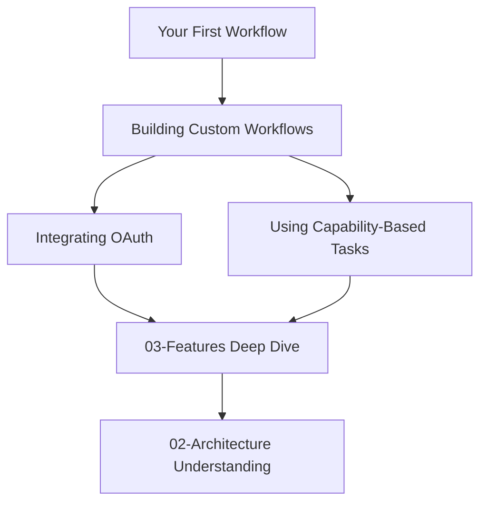
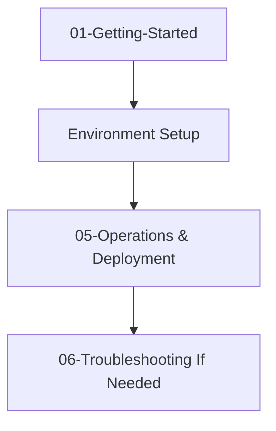

# Tutorials

**Start here if you're building with Glad Labs.**

These are guided, hands-on tutorials designed to help you achieve specific goals. Each tutorial walks you through a complete scenario from setup to success.

## Available Tutorials

### 1. [Your First Workflow](Your-First-Workflow.md)

**Goal:** Execute a blog post template end-to-end and see the results.

**What You'll Learn:**

- How to authenticate with Glad Labs
- How to trigger a workflow template
- How to poll for results
- How to retrieve and use the generated content

**Time:** ~15 minutes

**Prerequisites:** curl installed, dev token (or local setup)

---

### 2. [Building Custom Workflows](Custom-Workflows.md)

**Goal:** Compose your own multi-phase workflow and monitor execution in real-time.

**What You'll Learn:**

- How to design a workflow with multiple phases
- How to map data between phases (inputs/outputs)
- How to execute custom workflows
- How to monitor progress via WebSocket

**Time:** ~25 minutes

**Prerequisites:** Complete "Your First Workflow" tutorial (or curl knowledge)

---

### 3. [Integrating OAuth for Your App](OAuth-Integration.md)

**Goal:** Add Glad Labs authentication to your application.

**What You'll Learn:**

- How to set up GitHub OAuth delegation
- How to handle the OAuth callback
- How to store and manage JWT tokens securely
- How to handle logout

**Time:** ~20 minutes

**Prerequisites:** GitHub account, basic web app knowledge

---

### 4. [Using Capability-Based Tasks](Capability-Based-Tasks.md)

**Goal:** Let semantic intent matching automatically compose workflows for you.

**What You'll Learn:**

- How to describe a task in natural language
- How capability discovery works
- How the system automatically selects and composes services
- How to use intelligent task routing

**Time:** ~15 minutes

**Prerequisites:** "Your First Workflow" tutorial (understanding of workflows)

---

## Tutorial Structure

Each tutorial follows this pattern:

1. **Overview** — What you'll build and why it matters
2. **Prerequisites** — What you need before starting
3. **Step-by-Step Instructions** — Numbered steps with code examples
4. **What If It Fails?** — Common errors and solutions
5. **Next Steps** — Where to go after completing the tutorial

---

## Which Tutorial Should I Start With?

- **Completely new?** → Start with [Your First Workflow](Your-First-Workflow.md)
- **Want to build something custom?** → [Building Custom Workflows](Custom-Workflows.md)
- **Integrating into your app?** → [Integrating OAuth](OAuth-Integration.md)
- **Want the system to be smart?** → [Capability-Based Tasks](Capability-Based-Tasks.md)

---

## Complementary Resources

- **Need a quick reference?** → See [03-Features/README.md](../03-Features/README.md) for API contracts and examples
- **Want to understand the architecture?** → Read [02-Architecture/System-Design.md](../02-Architecture/System-Design.md)
- **Running into issues?** → Check [06-Troubleshooting/README.md](../06-Troubleshooting/README.md)
- **Need CLI help?** → See [07-Appendices/CLI-Commands-Reference.md](../07-Appendices/CLI-Commands-Reference.md)

---

## Learning Path

**For developers building integrations:**

**For operators/DevOps:**

---

## Estimated Time to Productive

| Path                          | Time   |
| ----------------------------- | ------ |
| New Developer all 4 tutorials | 75 min |
| Integrating OAuth Only        | 20 min |
| Building Custom Workflows     | 25 min |
| Operator Setup                | 30 min |

---

## Feedback

Found an issue in a tutorial? Want to improve a guide?

All tutorials are in `docs/02-Tutorials/` and contributions are welcome. Reference the Glad Labs contribution guidelines in the repository README.
