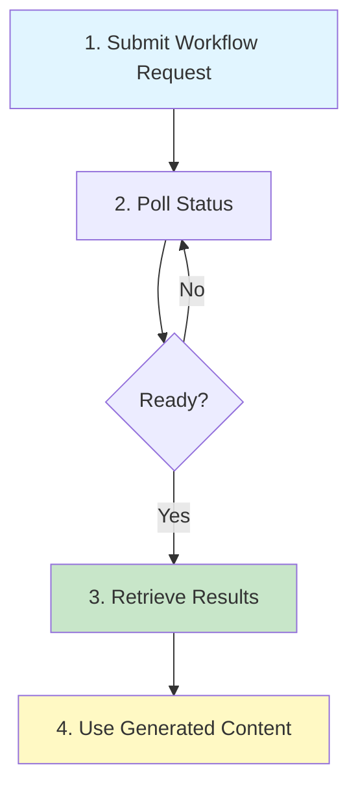

# Your First Workflow

**Goal:** Execute a blog post template end-to-end and see your first generated content in action.

**Time:** ~15 minutes  
**difficulty:** Beginner

---

## Overview

In this tutorial, you'll:

1. Set up authentication
2. Submit a blog post workflow request
3. Monitor execution in real-time
4. Retrieve and inspect the generated HTML

By the end, you'll understand the complete workflow lifecycle: request → execution → results.

---

## Prerequisites

**Required:**

- curl or Postman installed
- Glad Labs backend running (`npm run dev:cofounder` or `npm run dev`)
- `.env.local` properly configured (see [01-Getting-Started/Environment-Variables.md](../01-Getting-Started/Environment-Variables.md))

**Recommended:**

- ~5 minutes to read [03-Features/Workflows-System.md](../03-Features/Workflows-System.md) to understand workflow concepts

---

## Workflow Execution Lifecycle

Before you start, here's what will happen:



---

## Step 1: Authenticate

First, verify you can authenticate to the backend:

```bash
# Test authentication with dev-token
curl -X GET http://localhost:8000/api/auth/user \
  -H "Authorization: Bearer dev-token" \
  -H "Content-Type: application/json"
```

**Expected Response (HTTP 200):**

```json
{
  "user_id": "dev-user",
  "email": "dev@example.local",
  "name": "Development User",
  "created_at": "2026-03-08T00:00:00Z"
}
```

**What if it fails?**

| Error | Cause | Solution |
| --- | --- | --- |
| `401 Unauthorized` | Missing/invalid token | Check `Authorization` header starts with `Bearer` |
| `Connection refused` | Backend not running | Run `npm run dev:cofounder` or `npm run dev` |
| `Invalid attribute` error | Setup issue | Check `.env.local` DATABASE_URL and LLM keys |

---

## Step 2: Submit a Workflow Request

Now, submit a request to execute the `blog_post` template:

```bash
curl -X POST http://localhost:8000/api/workflows/execute/blog_post \
  -H "Authorization: Bearer dev-token" \
  -H "Content-Type: application/json" \
  -d '{
    "initial_inputs": {
      "topic": "The Future of AI in Web Development",
      "keywords": ["AI", "automation", "web development", "productivity"],
      "target_audience": "web developers",
      "tone": "informative, practical"
    },
    "model": "ollama/mistral"
  }'
```

**What each field means:**

- `topic` — The main subject for the blog post
- `keywords` — Key terms to incorporate
- `target_audience` — Who this is written for (helps tune language and examples)
- `tone` — Voice and style preferences
- `model` — Which LLM to use (see [03-Features/Model-Selection.md](../03-Features/Model-Selection.md) for options)

**Expected Response (HTTP 202 - Accepted):**

```json
{
  "workflow_id": "wf-abc123def456",
  "execution_id": "exec-xyz789",
  "status": "pending",
  "created_at": "2026-03-08T10:30:45Z",
  "phases": [
    {
      "phase_name": "research",
      "position": 1,
      "status": "pending"
    },
    {
      "phase_name": "draft",
      "position": 2,
      "status": "pending"
    },
    {
      "phase_name": "assess",
      "position": 3,
      "status": "pending"
    }
  ],
  "progress_percent": 0
}
```

**Save the `execution_id`** — You'll use it to check status and retrieve results.

---

## Step 3: Check Workflow Status

The blog post generation takes ~30-60 seconds. Check status with:

```bash
# Replace exec-xyz789 with your execution_id from Step 2
curl -X GET http://localhost:8000/api/workflows/exec-xyz789 \
  -H "Authorization: Bearer dev-token" \
  -H "Content-Type: application/json"
```

**Poll until status changes from `pending`:**

```json
{
  "workflow_id": "wf-abc123def456",
  "execution_id": "exec-xyz789",
  "status": "running",
  "progress_percent": 33,
  "current_phase": "research",
  "phase_results": [
    {
      "phase_name": "research",
      "status": "complete",
      "output": {
        "summary": "AI is transforming web development through automation...",
        "key_points": ["AI copilots", "code generation", "testing automation"],
        "sources": [
          {"url": "https://example.com/ai-dev", "title": "AI in Dev"}
        ]
      },
      "duration_ms": 12500,
      "completion_timestamp": "2026-03-08T10:31:15Z"
    }
  ]
}
```

**Keep polling** until:

- `status` = `"complete"` (success) OR
- `status` = `"failed"` (error)

---

## Step 4: Retrieve Results

Once status is `complete`, get the full results:

```bash
# Get final results
curl -X GET http://localhost:8000/api/workflows/exec-xyz789 \
  -H "Authorization: Bearer dev-token" \
  -H "Content-Type: application/json"
```

**Final Response (status = complete):**

```json
{
  "workflow_id": "wf-abc123def456",
  "execution_id": "exec-xyz789",
  "status": "complete",
  "progress_percent": 100,
  "created_at": "2026-03-08T10:30:45Z",
  "completed_at": "2026-03-08T10:32:30Z",
  "total_duration_ms": 105000,
  "phase_results": [
    {
      "phase_name": "research",
      "status": "complete",
      "output": {
        "summary": "AI is transforming web development...",
        "key_points": ["Automation", "Code generation", "Efficiency"],
        "sources": [...]
      },
      "duration_ms": 12500
    },
    {
      "phase_name": "draft",
      "status": "complete",
      "output": {
        "content": "# The Future of AI in Web Development\n\nArtificial Intelligence is revolutionizing...",
        "word_count": 1247,
        "estimated_read_time": 5
      },
      "duration_ms": 45000
    },
    {
      "phase_name": "assess",
      "status": "complete",
      "output": {
        "quality_score": 8.7,
        "feedback": "Excellent structure, practical examples, good coverage",
        "improvements": []
      },
      "duration_ms": 8500
    }
  ],
  "final_output": {
    "content_html": "<h1>The Future of AI in Web Development</h1>\n<p>Artificial Intelligence is revolutionizing...</p>",
    "content_markdown": "# The Future of AI in Web Development\n\nArtificial Intelligence is revolutionizing...",
    "seo_metadata": {
      "title": "The Future of AI in Web Development",
      "description": "Exploring how AI and automation are transforming modern web development practices",
      "keywords": ["AI", "web development", "automation", "productivity"]
    },
    "publication_ready": true
  }
}
```

**You now have:**

- `final_output.content_html` — Ready to publish to your blog
- `final_output.seo_metadata` — For search engine optimization
- Quality assessment showing the blog meets your standards

---

## Real-Time Monitoring (Optional)

Instead of polling, you can monitor progress in real-time using WebSocket. See [03-Features/WebSocket-Real-Time.md](../03-Features/WebSocket-Real-Time.md) for a JavaScript example.

Quick example:

```javascript
const ws = new WebSocket('ws://localhost:8000/api/ws/workflow/exec-xyz789');

ws.onmessage = (event) => {
  const message = JSON.parse(event.data);
  console.log(`Status: ${message.status}, Progress: ${message.progress_percent}%`);
};
```

---

## Common Errors & Solutions

### Error: `404 Not Found` on workflow endpoint

**Cause:** Template doesn't exist or typo in `blog_post`

**Solution:** Check available templates:

```bash
curl -X GET http://localhost:8000/api/workflows/templates \
  -H "Authorization: Bearer dev-token"
```

---

### Error: `400 Bad Request` on submit

**Cause:** Missing required fields in `initial_inputs`

**Solution:** Ensure your JSON includes ALL fields:

- `topic` (string)
- `keywords` (array of strings)
- `target_audience` (string)
- `tone` (string)

---

### Error: Status stuck at `pending` after 2+ minutes

**Cause:** Backend task executor may be slow or workflow is processing long input

**Solution:**

1. Check backend logs: `tail -f src/cofounder_agent/logs/cofounder_agent.log`
2. Verify model is running: `curl http://localhost:11434/api/tags` (for Ollama)
3. Check database connectivity: `echo "SELECT 1;" | psql $DATABASE_URL`

---

### Workflow status shows `failed`

**What happened:** One of the phases (research, draft, or assess) encountered an error.

**How to debug:**

1. Check the `phase_results` array for the failed phase
2. Look at the `error` field in the failed phase for details
3. Common causes:
   - Model returned invalid response → try different `model` parameter
   - Database connection dropped → restart backend
   - Rate limiting → wait 60 seconds and retry

---

## Next Steps

**What to do with your generated blog post:**

1. **Publish it:** Use your CMS or publish tool to add it to your blog
2. **Customize it:** Edit the content in `final_output.content_markdown` if needed
3. **Share SEO metadata:** Use `seo_metadata` fields when setting up your post

**Explore further:**

- [Building Custom Workflows](Custom-Workflows.md) — Compose your own multi-phase workflows
- [Integrating OAuth](OAuth-Integration.md) — Add authentication to your app
- [03-Features/Workflows-System.md](../03-Features/Workflows-System.md) — Deep dive into workflow concepts
- [03-Features/Model-Selection.md](../03-Features/Model-Selection.md) — Understand model options and costs

---

## Summary

You've successfully:

✅ Authenticated to Glad Labs  
✅ Submitted a blog post generation request  
✅ Monitored workflow execution  
✅ Retrieved generated content ready to publish  

**Total workflow time:** ~2 minutes

The same patterns apply to all workflows — just change the template name (`blog_post` → `social_media`, `email`, `newsletter`, etc.) and adjust `initial_inputs` as needed.

Congratulations! You're ready to build more complex workflows.
