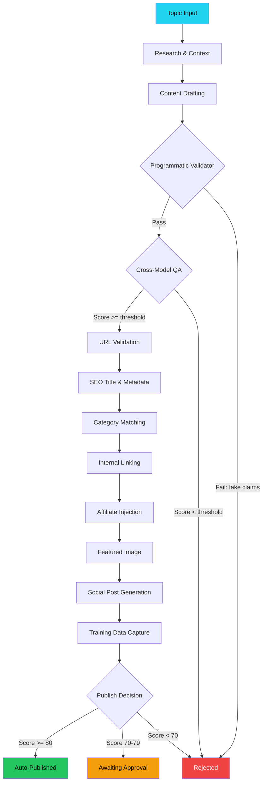
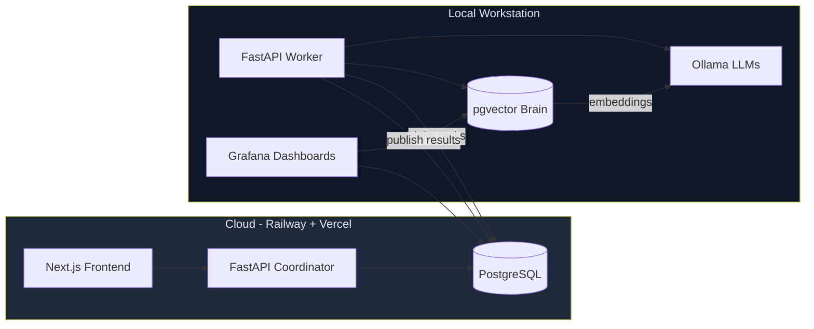
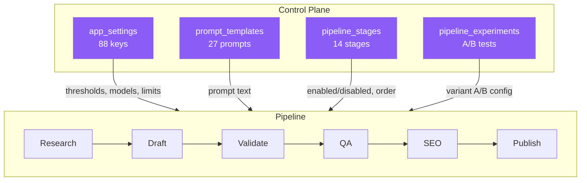
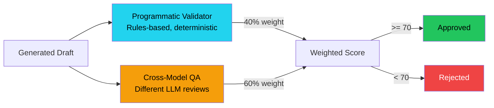

# Pipeline Architecture

## Content Pipeline Flow

```mermaid
graph TD
    A[Topic Input] --> B[Research & Context]
    B --> C[Content Drafting]
    C --> D{Programmatic Validator}
    D -->|Pass| E{Cross-Model QA}
    D -->|Fail: fake claims| X[Rejected]
    E -->|Score >= threshold| F[URL Validation]
    E -->|Score < threshold| X
    F --> G[SEO Title & Metadata]
    G --> H[Category Matching]
    H --> I[Internal Linking]
    I --> J[Affiliate Injection]
    J --> K[Featured Image]
    K --> L[Social Post Generation]
    L --> M[Training Data Capture]
    M --> N{Publish Decision}
    N -->|Score >= 80| P[Auto-Published]
    N -->|Score 70-79| Q[Awaiting Approval]
    N -->|Score < 70| X

    style A fill:#22d3ee,color:#000
    style P fill:#22c55e,color:#000
    style Q fill:#f59e0b,color:#000
    style X fill:#ef4444,color:#fff
```

## System Architecture

```mermaid
graph LR
    subgraph Cloud [Cloud - Railway + Vercel]
        API[FastAPI Coordinator]
        DB[(PostgreSQL)]
        FE[Next.js Frontend]
        API --> DB
        FE --> API
    end

    subgraph Local [Local Workstation]
        Worker[FastAPI Worker]
        Ollama[Ollama LLMs]
        PGV[(pgvector Brain)]
        Grafana[Grafana Dashboards]
        Worker --> Ollama
        Worker --> PGV
        Grafana --> PGV
        Grafana --> DB
    end

    Worker -->|claim tasks| DB
    Worker -->|publish results| DB
    PGV -->|embeddings| Ollama

    style Cloud fill:#1e293b,color:#e2e8f0
    style Local fill:#0f172a,color:#e2e8f0
```

## Database-Driven Configuration

```mermaid
graph TD
    subgraph Control Plane
        AS[app_settings<br/>88 keys]
        PT[prompt_templates<br/>27 prompts]
        PS[pipeline_stages<br/>14 stages]
        PE[pipeline_experiments<br/>A/B tests]
    end

    subgraph Pipeline
        R[Research] --> D[Draft] --> V[Validate] --> Q[QA] --> S[SEO] --> P[Publish]
    end

    AS -->|thresholds, models, limits| Pipeline
    PT -->|prompt text| Pipeline
    PS -->|enabled/disabled, order| Pipeline
    PE -->|variant A/B config| Pipeline

    style AS fill:#8b5cf6,color:#fff
    style PT fill:#8b5cf6,color:#fff
    style PS fill:#8b5cf6,color:#fff
    style PE fill:#8b5cf6,color:#fff
```

## Multi-Model QA

```mermaid
graph LR
    Draft[Generated Draft] --> PV[Programmatic Validator<br/>Rules-based, deterministic]
    Draft --> CM[Cross-Model QA<br/>Different LLM reviews]
    PV -->|40% weight| Score[Weighted Score]
    CM -->|60% weight| Score
    Score -->|>= 70| Pass[Approved]
    Score -->|< 70| Fail[Rejected]

    style PV fill:#22d3ee,color:#000
    style CM fill:#f59e0b,color:#000
    style Pass fill:#22c55e,color:#000
    style Fail fill:#ef4444,color:#fff
```
