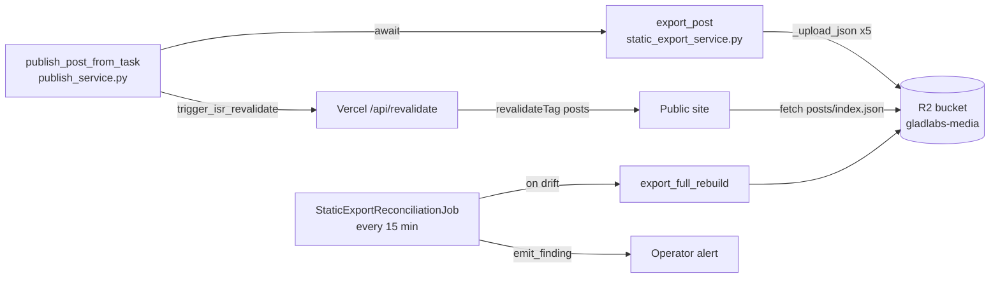

# Static Export Pipeline

The public site (`web/public-site/`) reads its post listings and content
**exclusively from R2** — there is no API call from Vercel back into the
worker for routine reads. The `lib/posts.ts → fetchPostIndex` helper fetches
`https://pub-1432fdefa18e47ad98f213a8a2bf14d5.r2.dev/static/posts/index.json`
and uses Next.js tag-based caching (`{ tags: ['posts', 'post-index'] }`)
that the worker invalidates on publish.

This means **R2 is the source of truth for the homepage and archive.** A
publish that creates a `posts` row but never refreshes R2 silently freezes
the public site until the next successful export.

## Files on R2 (`static/` prefix)

| Key                        | Contents                                                                                 |
| -------------------------- | ---------------------------------------------------------------------------------------- |
| `static/posts/index.json`  | Every published post's summary metadata (no body). Loaded on every page render.          |
| `static/posts/{slug}.json` | Full post (markdown converted to HTML) for the detail page.                              |
| `static/feed.json`         | [JSON Feed 1.1](https://jsonfeed.org) for syndication — gated on `posts.distributed_at`. |
| `static/sitemap.json`      | URL + last-modified for `sitemap.xml`.                                                   |
| `static/categories.json`   | Category list (full rebuild only).                                                       |
| `static/authors.json`      | Author list (full rebuild only).                                                         |
| `static/manifest.json`     | Export metadata: `exported_at`, `post_count`, `last_published_slug`.                     |

## Write paths

### `publish_post_from_task` (synchronous since 2026-05-11)

`services/publish_service.py:publish_post_from_task` is the single entry
point for materializing a published post. After the `posts` row INSERT
it now **awaits** `export_post(_pool, slug)` inline. The return value
lands on `PublishResult.static_export_success` so `/approve` and
`/publish` callers can surface the failure.

Originally (pre-2026-05-11) `export_post` was scheduled via
`_spawn_background(...)` as a fire-and-forget asyncio task. That worked
for the long-lived FastAPI worker but failed silently in two scenarios:

1. **Prefect subprocess auto-publish** — the `content_generation` flow
   runs in a subprocess that terminates when the flow returns. Background
   tasks scheduled mid-flow were cancelled before completing.
2. **Worker restart mid-publish** — any restart between INSERT and the
   asyncio scheduler picking up the fire-and-forget task dropped the work.

Between 2026-05-08 and 2026-05-11 four published posts never reached the
bucket; the homepage silently lagged the DB by 3 days. The await-inline
fix trades ~3-5s of publish latency for guaranteed consistency.

### `StaticExportReconciliationJob` (every 15 min)

Safety net at `services/jobs/static_export_reconciliation.py`. Compares
`COUNT(*) FROM posts WHERE status='published'` against `post_count` in
`static/manifest.json`. On drift (count mismatch or manifest older than
the newest published_at by more than `stale_minutes`, default 30) it
fires `export_full_rebuild` and emits an `r2_static_drift` finding via
`utils.findings.emit_finding`.

Config keys (under `plugin.job.static_export_reconciliation`):

- `stale_minutes` — manifest staleness threshold (default 30)
- `r2_manifest_url` — manifest probe URL (default points at the public
  R2 endpoint)
- `alert_on_drift` — emit a finding alongside the rebuild (default true)

The job is registered in `plugins/registry.py` next to
`VerifyPublishedPostsJob`; together they cover the two complementary
failure modes (R2 missing the post vs. the public URL returning non-200).

### `fire_post_distribution_hooks` (gate clearance path)

When approval gates clear on a `status='awaiting_gates'` post,
`publish_service.fire_post_distribution_hooks` flips the status to
`published` and **also** calls `export_post` (still via
`_spawn_background` for now — separate gate-engine path with different
lifecycle, not in scope for the 2026-05-11 fix).

## Credentials

Reads from `app_settings` (category `general`):

| Key                  | Required | Notes                                                                             |
| -------------------- | -------- | --------------------------------------------------------------------------------- |
| `storage_endpoint`   | yes      | S3-compatible endpoint URL.                                                       |
| `storage_bucket`     | yes      | Bucket name (currently `gladlabs-media`).                                         |
| `storage_access_key` | yes      | Cached in `site_config` (non-secret pairing).                                     |
| `storage_secret_key` | yes      | `is_secret=true` — fetched via `site_config.get_secret`.                          |
| `storage_public_url` | yes      | Public CDN URL (currently `https://pub-1432fdefa18e47ad98f213a8a2bf14d5.r2.dev`). |

Legacy `cloudflare_r2_*` keys still resolve as a fallback (see
`services/r2_upload_service.py:_storage`) but are deprecated.

## Operator runbook

**"R2 is stale, what do I do?"**

1. Check the reconciliation watchdog's last `job_runs` entry — if it's
   firing and the rebuild is failing, the metric in
   `static_export_reconciliation` job logs will show `rebuild_ok=0`.
2. Run a manual rebuild via the MCP `rebuild_static_export` tool or
   directly: `docker exec poindexter-worker python -c "..."` invoking
   `services.static_export_service.export_full_rebuild`.
3. Trigger ISR revalidation so Vercel re-fetches:
   `await trigger_isr_revalidate(slug, site_config=sc)`.

**"How do I know if a specific publish hit R2?"**

After 2026-05-11 the publish endpoints return
`PublishResult.static_export_success` — `true` means R2 got the new
index. Pre-2026-05-11 publishes have no per-publish signal; cross-check
the manifest's `last_published_slug` instead.
